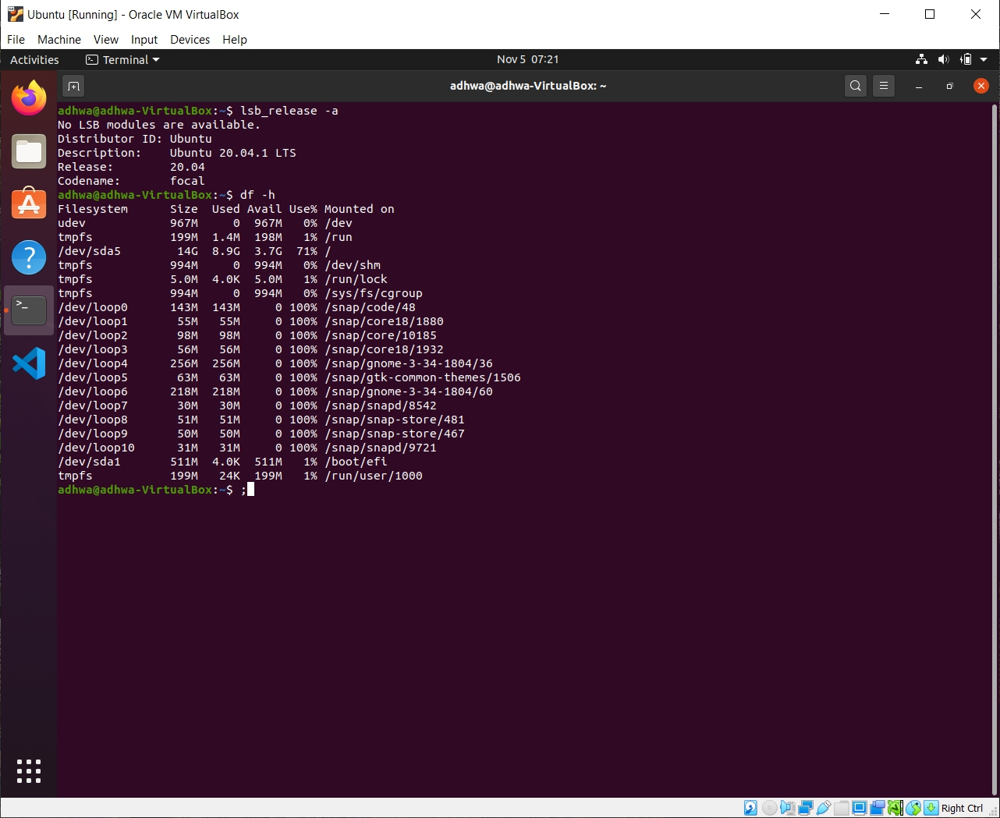
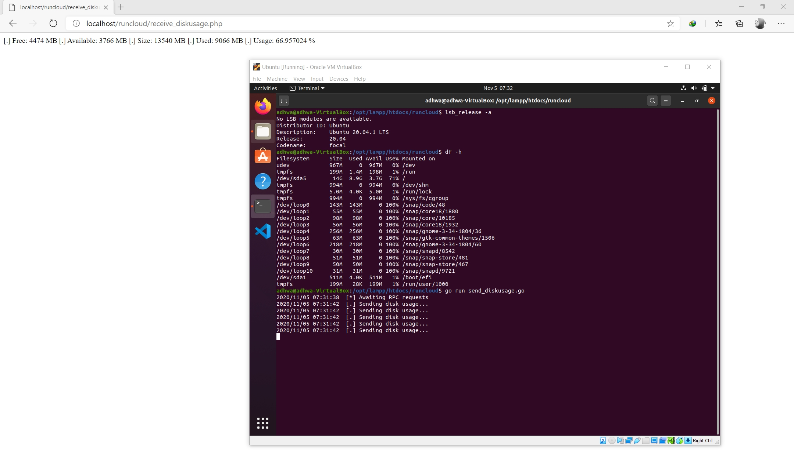

# Message Broker (RabbitMQ)

### Read Me - Last Updated: 2020/11/06

Prerequisite:

* RabbitMQ
* VirtualBox
* Ubuntu 20.04 LTS
* Windows 10
* PHP
* Golang
* Composer

Files:

1. PHP Application - receive_diskusage.php
2. Message Broker (Config) – advanced.config
3. Linux Application – send_diskusage.go

#### Host Details

#### Result

